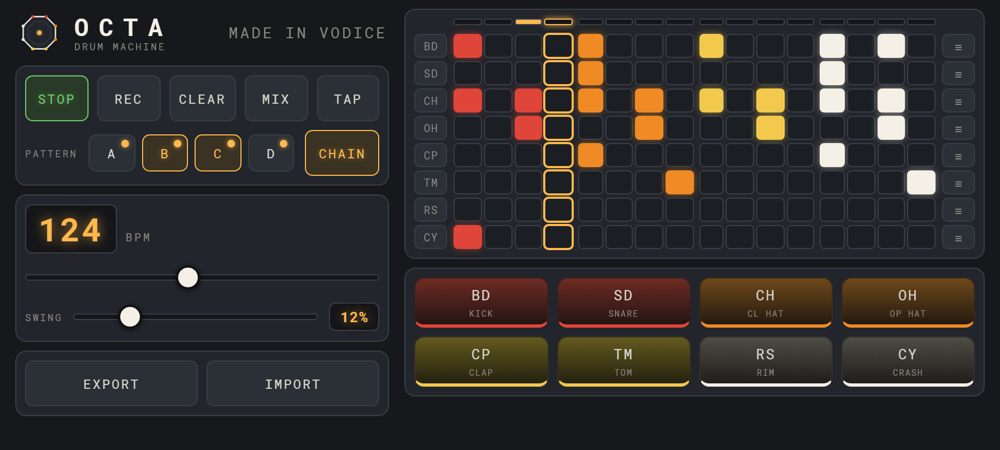
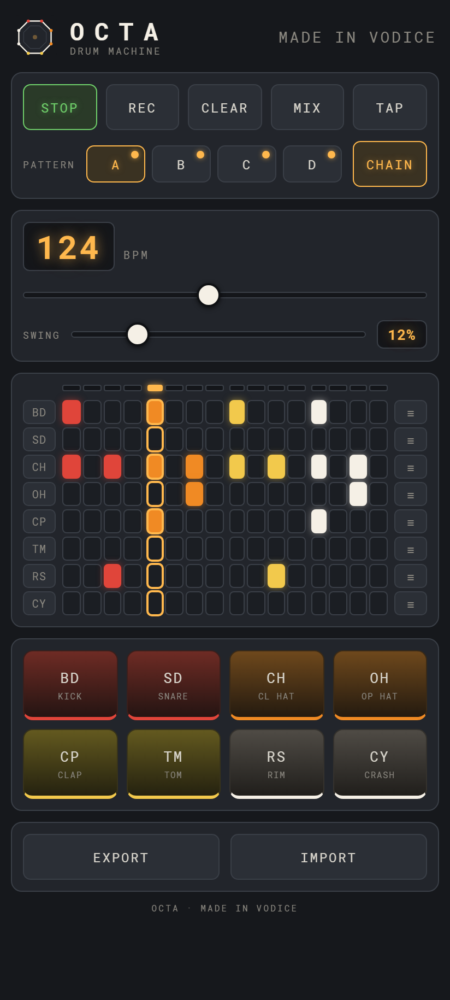

# OCTA

**8-voice drum machine** — mobile-first, running entirely in the browser. No
build step, no frameworks, no sample files: all eight voices are synthesised
live with the Web Audio API.

<p align="center">
  
</p>

<p align="center">
  
</p>

<p align="center">
  
</p>

## Features

- **8 synth voices** — BD kick, SD snare, CH/OH hats, CP clap, TM tom, RS
  rimshot, CY crash. All generated in real time.
- **16-step sequencer** with a sample-accurate lookahead scheduler — no
  timing drift after minutes of playback.
- **BPM 60–200** and **swing 0–60%**, both changeable while playing.
- **4 pattern slots (A/B/C/D)** — switching mid-play takes effect at the
  next bar.
- **CHAIN mode** — auto-advance A→B→C→D and back, turning a loop into an
  arrangement. Long-press a letter to drop it from the chain.
- **Live step recording** — arm `REC` and play the pads while the sequencer
  runs; hits are written in, quantised to the nearest 16th.
- **Finger-drumming pads** that trigger on `pointerdown` for low latency.
- **Per-voice mixer**, tap tempo, autosave to `localStorage`, and JSON
  export/import.
- **Portrait and landscape layouts** — held sideways, the grid and pads move
  into their own full-height column.
- Installable **PWA** with offline support, and an **Android build** via
  Capacitor.

Two demo songs are included: `octa-song.json` (house) and
`octa-song-techno.json`. Load either with `IMPORT`.

## Run it on your phone (Windows 11 / PowerShell)

The app is just static files, so any local web server works. Your phone and
PC must be on the **same Wi-Fi network**.

### 1. Start a server from the project folder

```powershell
cd path\to\octa

# Option A — Node (downloads 'serve' on first use):
npx serve -l 8080

# Option B — Python 3:
python -m http.server 8080
```

### 2. Find your PC's local IP address

```powershell
(Get-NetIPAddress -AddressFamily IPv4 |
  Where-Object { $_.IPAddress -like '192.168.*' -or $_.IPAddress -like '10.*' }
).IPAddress
```

Note the address it prints (e.g. `192.168.1.42`).

### 3. Open it on the phone

In Chrome on Android, browse to:

```
http://<your-ip>:8080
```

for example `http://192.168.1.42:8080`. Press **PLAY** — pattern A is
preloaded with a house groove, so it makes sound immediately.

> **First tap makes the sound:** Android blocks audio until you interact
> with the page, so the audio engine is created/resumed on your first tap.

### 4. (Optional) Install to the home screen

In Chrome's menu choose **Add to Home screen**. OCTA installs as a
standalone, portrait app with its own icon and works offline afterwards.

### If the phone can't reach the server

Windows Firewall usually prompts on first run — allow access on
**Private networks**. To add a rule manually (run PowerShell as
Administrator):

```powershell
New-NetFirewallRule -DisplayName "OCTA dev server" -Direction Inbound `
  -Protocol TCP -LocalPort 8080 -Action Allow -Profile Private
```

## Project layout

| File | Purpose |
|------|---------|
| `index.html` | Markup + service-worker registration |
| `style.css` | Dark hardware theme, portrait + landscape layouts |
| `audio.js` | Web Audio synthesis engine (`AudioEngine`) |
| `sequencer.js` | Lookahead scheduler + patterns (`Sequencer`) |
| `ui.js` | DOM wiring, draw loop, persistence |
| `manifest.json`, `sw.js` | PWA manifest + offline service worker |
| `icon.svg`, `favicon.svg`, `icon-192/512.png` | Branding / PWA icons |
| `android/` | Capacitor Android project (wrapper — the web files are the source) |
| `tools/render-icons.ps1` | Regenerates the PNG icons from the mark |
| `tools/sync-www.mjs` | Mirrors the web files into `www/` for packaging |
| `store-assets/` | Google Play listing copy, screenshots, feature graphic |

## Android build

The web files at the root are the single source of truth; `www/` is generated,
not edited.

```powershell
npm install

npm run apk      # debug APK  -> octa-debug.apk
npm run release  # signed AAB -> android/app/build/outputs/bundle/release/
```

`npm run release` needs a signing keystore — see
[android/keystore/README.md](android/keystore/README.md). The Play Store
listing text and graphics live in
[store-assets/](store-assets/), with the publishing steps in
[store-assets/PLAY-CHECKLIST.md](store-assets/PLAY-CHECKLIST.md).

Regenerate the store screenshots and feature graphic (needs a local server on
port 8099 for the screenshots):

```powershell
npx serve -l 8099            # in one terminal
node tools/capture-store-screenshots.mjs
node tools/render-feature-graphic.mjs
```

## Regenerating the icons

If you tweak the logo, re-render the PNGs:

```powershell
.\tools\render-icons.ps1
```

## Extending it later

The code is commented with extension in mind:

- **Velocity per step** — the grid stores `0/1`; widen to `0..1` and pass it
  as a gain multiplier into `engine.trigger(id, time, velocity)`.
- **More sounds** — add an entry to `VOICES` in `audio.js` and a
  matching `_synth` method; the grid, pads, and mixer build themselves from
  that list.
- **Song mode** — patterns chain A→B→C→D today; a per-slot repeat count would
  turn the chain into a full arrangement.

## Notes on audio quality

- Gains are ramped with `exponentialRampToValueAtTime` and never hard-stopped
  at a nonzero value, so there are no clicks.
- Note timing runs on the AudioContext hardware clock via a 25 ms
  lookahead scheduler (not `setInterval` note-by-note), so it stays locked
  even when the main thread is busy.

## Licence

[GPL-3.0](LICENSE) — OCTA is free software. Made in Vodice.
